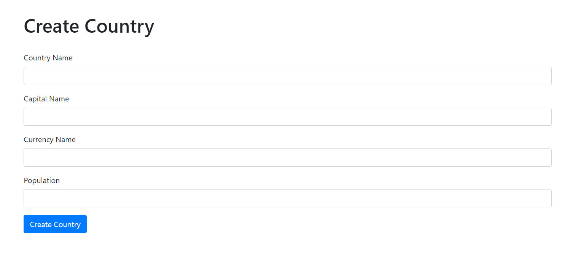
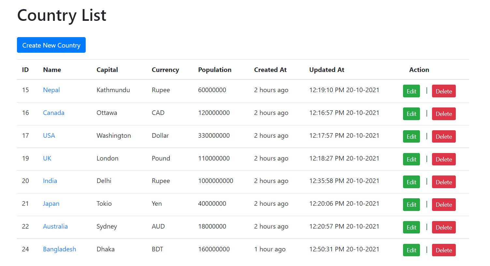
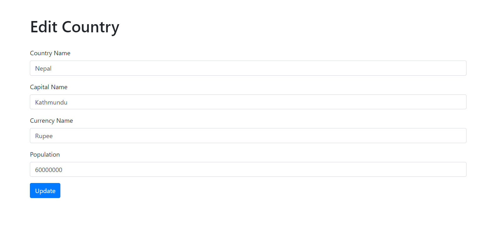
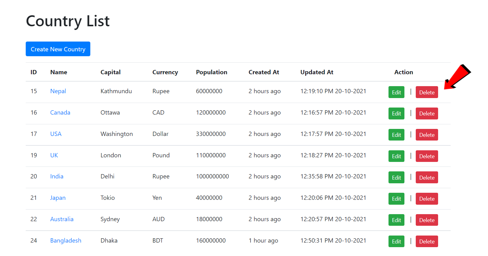

<!DOCTYPE html>
<html>
<body>

  <h2>Practicing Laravel - 07</h2>
  <h3><b>CRUD Operations</b></h3>
    

  <h4>Screenshots:</h4>
   

  <table>
    <tr>
      <td>
        <h5>Create:</h5>
        
      </td>
      <td>
        <h5>Read:</h5>
        
      </td>
    </tr>
    <tr>
      <td>
        <h5>Update:</h5>
        
      </td>
      <td>
        <h5>Delete:</h5>
            
      </td>
    </tr>
  </table>
</body>
</html>