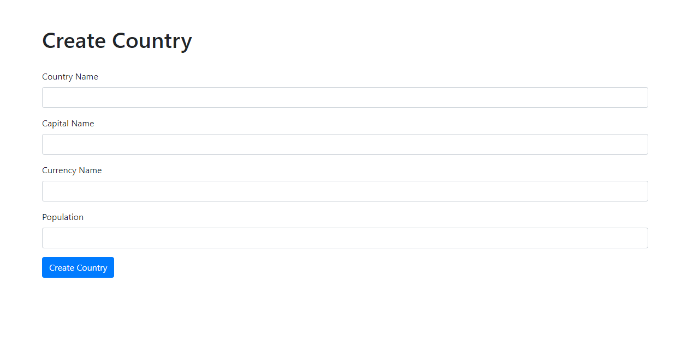
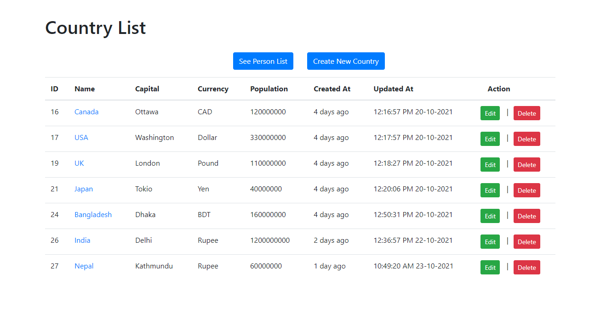

<!DOCTYPE html>
<html>
<body>

  <h2>Practicing Laravel - 08</h2>
  <h3><b>Here, I have practiced the One-to-Many relationship.</b></h3>
   

  <h3>Screenshots:</h3>

  <h4>Country</h4>
  <table>
    <tr>
      <td>
        <h5>Create:</h5>
        
      </td>
      <td>
        <h5>Read:</h5>
        
      </td>
      <td>
        <h5>Update:</h5>
        
      </td>
      <td>
        <h5>Delete:</h5>
            
      </td>
      <td>
        <h5>Details:</h5>
            
      </td>
    </tr>
  </table>
  <h4>Person</h4>
  <table>
    <tr>
      <td>
        <h5>Create:</h5>
        
      </td>
      <td>
        <h5>Read:</h5>
        
      </td>
      <td>
        <h5>Update:</h5>
        
      </td>
      <td>
        <h5>Delete:</h5>
            
      </td>
      <td>
        <h5>Details:</h5>
            
      </td>
    </tr>
  </table>
   
</body>
</html>